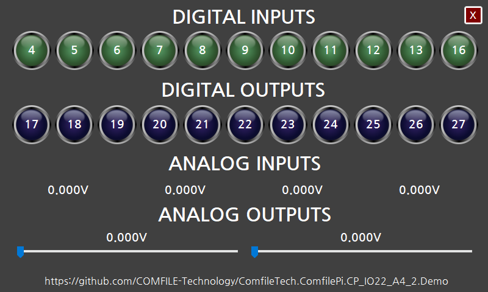

# ComfileTech.ComfilePi.CP_IO22_A4_2.Demo

This is a .NET Framework Winforms application to demonstrate features of the [CP-IO22-A4-2](https://comfiletech.com/raspberry-pi-panel-pc/cp-io22-a4-2-digital-analog-i-o-board-for-the-cpi-s-series/) IO board for COMFILE Technology's [ComfilePi industrial touchscreen panel PCs](https://comfiletech.com/linux-panel-pc/), and how to program it.

Execution on a ComfilePi panel PC requires [Mono](https://gitlab.winehq.org/mono/mono), which should already be installed by default on the ComfilePi panel PCs.

This application uses the following .NET libraries to control the GPIO and I2C devices on the CP-IO22-A4-2 board.
* [System.Device.Gpio](https://www.nuget.org/packages/System.Device.Gpio/)
* [Iot.Device.Bindings](https://www.nuget.org/packages/Iot.Device.Bindings/)

Although the `ComfileTech.ComfilePi.CP_IO22_A4_2.Demo` project is a .NET Framework Winforms application, the `ComfileTech.ComfilePi.CP_IO22_A4_2` project is a .NET Standard library, so it can also be used in more recent .NET 8+ applications.

## Deploying to and Debugging on a ComfilePi Panel PC

Install COMFILE Technology's [Remote Mono Debugger Visual Studio extension](http://www.comfilewiki.co.kr/en/doku.php?id=comfilepi:running_.net_winforms_applications_with_mono:remote_mono_debugger:index#ssh_authentication), and then edit the `ComfilePi` launch profile to deploy the application to and debug it on a ComfilePi from within Visual Studio.

## Designer Not Displaying in Visual Studio
This application uese [Nanum Gothic](https://fonts.google.com/specimen/Nanum+Gothic) fonts so it can be portable between Windows and Linux without licensing issues and can display both English and Korean text.  There appears to be a bug in Visual Studio that prevents the Winforms designer for the main `Form1.cs` from displaying if the form's fonts are not installed.  If you encounter this issue, please install the [Nanum Gothic](https://fonts.google.com/specimen/Nanum+Gothic) font package, and then the designer should then display.
