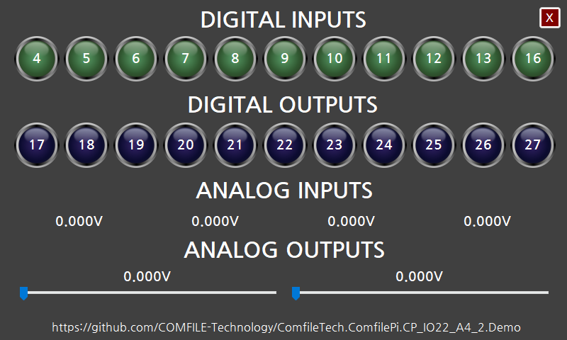

# ComfileTech.ComfilePi.CP_IO22_A4_2.Demo

This repository demonstrates the [CP-IO22-A4-2](https://comfiletech.com/raspberry-pi-panel-pc/cp-io22-a4-2-digital-analog-i-o-board-for-the-cpi-s-series/) I/O board for [ComfilePi industrial touchscreen panel PCs](https://comfiletech.com/linux-panel-pc/). The shared `ComfileTech.ComfilePi.CP_IO22_A4_2` project provides access to the board's digital inputs, digital outputs, analog inputs, and analog outputs.

There are two demo applications:

* `ComfileTech.ComfilePi.CP_IO22_A4_2.Demo` is a WinForms demo with the original 800x480 touchscreen UI. It uses Microsoft's WinForms implementation on Windows (`net10.0-windows`) and [ComfileTech.WinForms](https://www.comfilewiki.co.kr/en/doku.php?id=winforms:index) on Linux (`net10.0`).
* `ComfileTech.ComfilePi.CP_IO22_A4_2.BlazorServerDemo` is a Blazor Server demo with the same control surface rendered in a browser. It shares board state across connected clients, so output changes from one browser appear in the others in real time.

Both demo projects and the hardware library target .NET 10. The projects use:

* [System.Device.Gpio](https://www.nuget.org/packages/System.Device.Gpio/)
* [ComfileTech.WinForms](https://www.comfilewiki.co.kr/en/doku.php?id=winforms:index) for the Linux WinForms demo
* ASP.NET Core Blazor Server for the browser-based demo

## Running the Demos

Use Visual Studio or `dotnet build source/ComfileTech.ComfilePi.CP_IO22_A4_2.Demo.slnx` to build the solution.

For the WinForms demo, run the `ComfileTech.ComfilePi.CP_IO22_A4_2.Demo` project. To publish for a ComfilePi panel PC, use the `linux-arm64.pubxml` publish profile, copy the published files to the panel, run `chmod +x Demo`, then start it with `./Demo`.

For the Blazor Server demo, run or publish `ComfileTech.ComfilePi.CP_IO22_A4_2.BlazorServerDemo`. The launch profile binds to `http://0.0.0.0:5213` so other clients on the same network can connect. After publishing to the panel, run `chmod +x ComfileTech.ComfilePi.CP_IO22_A4_2.BlazorServerDemo`, then start it with `ASPNETCORE_URLS=http://0.0.0.0:5213 ./ComfileTech.ComfilePi.CP_IO22_A4_2.BlazorServerDemo`.

## Debugging on a ComfilePi Panel PC

To debug the Linux target from Visual Studio, install COMFILE Technology's [Remote .NET Debugger extension](https://www.comfilewiki.co.kr/en/doku.php?id=comfilepi:dotnet_core_development:remote_debugger:index), then edit the `Remote linux-arm64` launch profile with the target device's connection settings.

## Designer Not Displaying in Visual Studio

The WinForms demo uses [Nanum Gothic](https://fonts.google.com/specimen/Nanum+Gothic) so it can display English and Korean text on Windows and Linux. If Visual Studio cannot display the WinForms designer for `Form1.cs`, install the Nanum Gothic font package and reopen the designer.
